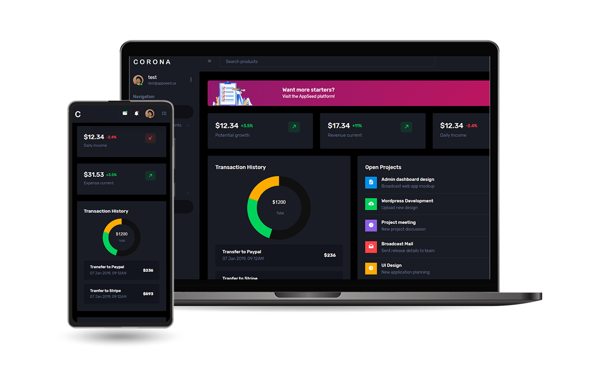

<div align="center">
  
</div>

# 🌐 Django - My Finances
<div align="center">
  
</div>

<p align="center">
  <a href="https://github.com/guedes-jr/django-my-finances">
    
  </a>
  <a href="https://github.com/guedes-jr/django-my-finances/issues">
    
  </a>
  <a href="https://github.com/guedes-jr/django-my-finances/network">
    
  </a>
  <a href="https://github.com/guedes-jr/django-my-finances/stargazers">
    
  </a>
  <a href="https://github.com/guedes-jr/django-my-finances/blob/main/LICENSE">
    
  </a>
</p>

## 📝 Sumário

- [Sobre o Projeto](#%EF%B8%8Fsobre-o-projeto)
- [Tecnologias Utilizadas](#-tecnologias-utilizadas)
- [Funcionalidades](#-funcionalidades)
- [Requisitos](#-requisitos)
- [Instalação](#-instalação)
- [Estrutura de Pastas](#-estrutura-de-pastas)
- [Licença](#-licença)
- [Contato](#-contato)

## 🛠️Sobre o Projeto

Projeto para gerenciamento de financias pessoais, utilçizadndo o Framework [Django](https://www.djangoproject.com/), banco de dados [SQLite](https://www.sqlite.org/index.html) e para agilizar o front end utilizado o template [Corona](https://www.bootstrapdash.com/product/corona-admin-template), disponível em [Bootstrapdash](https://www.bootstrapdash.com/).


## 🧰 Tecnologias Utilizadas

- [Django](https://www.djangoproject.com/) - Framework de back-end
- [Python](https://www.python.org/) - Linguagem de programação
- [Bootstrap](https://getbootstrap.com/) - Framework de front-end
- [SQLite](https://www.sqlite.org/index.html) - Banco de dados
- [HTML](https://developer.mozilla.org/en-US/docs/Web/HTML) - Linguagem de marcação para construção de páginas web
- [CSS](https://developer.mozilla.org/en-US/docs/Web/CSS) - Linguagem de estilo para páginas web
- [JavaScript](https://developer.mozilla.org/en-US/docs/Web/JavaScript) - Linguagem de programação para web
 *
## ✨ Funcionalidades

- Base para novos projetos com telas de interfaces préprontas

## 📋 Requisitos

- [Python 3](https://www.python.org/downloads/release/python-315/)
- [Django](https://www.djangoproject.com/)

## 🚀 Instalação

### Clonando o Repositório

```bash
git clone https://github.com/guedes-jr/django-my-finances.git
```
```bash
# Criar ambiente virtual
python3 -m venv venv

# Ativar ambiente virtual
source venv/bin/activate  # No Windows use `venv\Scripts\activate`

# Instalar dependências necessárias para execução do projeto
pip install -r requirements.txt
```

## 📁 Estrutura de Pastas

```plaintext
├── core
│   ├── __init__.py
│   ├── admin.py
│   ├── apps.py
│   ├── models.py
│   ├── static
│   │   ├── docs
│   │   │   ├── script.js
│   │   │   └── style.css
│   │   └── home
│   │       ├── home.css
│   │       └── home.js
│   ├── templates
│   │   ├── blank-page.html
│   │   ├── charts
│   │   │   └── chartjs.html
│   │   ├── docs
│   │   │   └── documentation.html
│   │   ├── error-404.html
│   │   ├── error-500.html
│   │   ├── forms
│   │   │   └── basic_elements.html
│   │   ├── home.html
│   │   ├── icons
│   │   │   └── font-awesome.html
│   │   ├── login.html
│   │   ├── register.html
│   │   ├── tables
│   │   │   └── basic-table.html
│   │   └── ui-features
│   │       ├── buttons.html
│   │       ├── dropdowns.html
│   │       └── typography.html
│   ├── tests.py
│   ├── urls.py
│   └── views.py
├── corona
│   ├── __init__.py
│   ├── asgi.py
│   ├── settings.py
│   ├── urls.py
│   └── wsgi.py
├── db.sqlite3
├── doc
│   ├── corona-free.zip
│   ├── django-Logo.png
│   ├── image-demo-corona.png
├── env
│   ├── bin
│   │   ├── Activate.ps1
│   │   ├── activate
│   │   ├── activate.csh
│   │   ├── activate.fish
│   │   ├── django-admin
│   │   ├── pip
│   │   ├── pip3
│   │   ├── pip3.12
│   │   ├── python -> python3
│   │   ├── python3 -> /usr/bin/python3
│   │   ├── python3.12 -> python3
│   │   └── sqlformat
│   ├── lib
│   │   └── ...
├── estruct.txt
├── manage.py
├── readme.md
├── requeriments.txt
├── static
│   ├── css
│   │   ├── global.css
│   │   ├── maps
│   │   │   └── style.css.map
│   │   └── style.css
│   ├── fonts
│   │   ├── Assistant
│   │   │   └── ...
│   │   ├── Rubik
│   │   │   ├── ...
│   │   └── fonts
│   │       └── ...
│   ├── images
│   │   ├── auth
│   │   │   └── ...
│   │   ├── carousel
│   │   │   └── ...
│   │   ├── dashboard
│   │   │   └── ...
│   │   ├── faces
│   │   │   └── ...
│   │   ├── faces-clipart
│   │   │   └── ...
│   │   ├── favicon.ico
│   │   ├── favicon.png
│   │   ├── favicon1.png
│   │   ├── file-icons
│   │   │   ├── 128
│   │   │   ├── 256
│   │   │   ├── 512
│   │   │   ├── 64
│   │   │   └── flag.png
│   │   ├── lightbox
│   │   │   └── ...
│   │   ├── logo-mini.svg
│   │   ├── logo.svg
│   │   ├── samples
│   │   │   └── ...
│   │   ├── screenshots
│   │   │   └── ...
│   │   └── sprites
│   │       └── ...
│   ├── js
│   │   ├── chart.js
│   │   ├── dashboard.js
│   │   ├── file-upload.js
│   │   ├── jquery.cookie.js
│   │   ├── misc.js
│   │   ├── off-canvas.js
│   │   ├── owl-carousel.js
│   │   ├── proBanner.js
│   │   ├── select2.js
│   │   ├── settings.js
│   │   ├── todolist.js
│   │   ├── tooltips.js
│   │   └── typeahead.js
│   └── vendors
│       ├── bootstrap-datepicker
│       │   └── fonts
│       │       └── ...
│       ├── bootstrap-maxlength
│       │   └── bootstrap-maxlength.min.js
│       ├── chart.js
│       │   └── chart.umd.js
│       ├── codemirror
│       │   ├── ambiance.css
│       │   ├── codemirror.css
│       │   ├── codemirror.js
│       │   ├── javascript.js
│       │   └── shell.js
│       ├── css
│       │   └── vendor.bundle.base.css
│       ├── flag-icon-css
│       │   ├── css
│       │   │   └── flag-icons.min.css
│       │   └── flags
│       │       └── ...
│       ├── font-awesome
│       │   ├── css
│       │   │   └── font-awesome.min.css
│       │   └── fonts
│       │       └── fontawesome...
│       ├── jquery-file-upload
│       │   ├── jquery.uploadfile.min.js
│       │   └── uploadfile.css
│       ├── js
│       │   ├── bootstrap.min.js.map
│       │   └── vendor.bundle.base.js
│       ├── jvectormap
│       │   ├── jquery-jvectormap-world-mill-en.js
│       │   ├── jquery-jvectormap.css
│       │   └── jquery-jvectormap.min.js
│       ├── mdi
│       │   ├── css
│       │   │   ├── materialdesignicons.min.css
│       │   │   └── materialdesignicons.min.css.map
│       │   └── fonts
│       │       └── materialdesignicons...
│       ├── owl-carousel-2
│       │   ├── owl.carousel.min.css
│       │   ├── owl.carousel.min.js
│       │   ├── owl.theme.default.min.css
│       │   └── owl.video.play.png
│       ├── pwstabs
│       │   ├── jquery.pwstabs.min.css
│       │   └── jquery.pwstabs.min.js
│       ├── select2
│       │   ├── select2.min.css
│       │   └── select2.min.js
│       ├── select2-bootstrap-theme
│       │   └── select2-bootstrap.min.css
│       ├── simple-line-icons
│       │   ├── css
│       │   │   └── simple-line-icons.css
│       │   └── fonts
│       │       └── Simple-Line-Icons...
│       ├── ti-icons
│       │   ├── css
│       │   │   └── themify-icons.css
│       │   └── fonts
│       │       └── themify...
│       └── typeahead.js
│           └── typeahead.bundle.min.js
└── templates
    └── shared
        ├── base.html
        └── partials
            ├── _footer.html
            ├── _header.html
            ├── _navbar.html
            ├── _scripts.html
            └── _sidebar.html
```

## 📄 Licença

Este projeto está licenciado sob a Licença MIT - veja o arquivo [LICENSE](LICENSE) para detalhes.

## 📧 Contato

👤 **João Guedes**

- Github: [@guedes-jr](https://github.com/guedes-jr)
- LinkedIn: [João Guedes](https://www.linkedin.com/in/jo%C3%A3o-guedes-36a440135)
- Email: joao.guedes.developer@gmail.com

---

Desenvolvido com profissionalismo por [João Guedes](https://github.com/guedes-jr) 🤖.